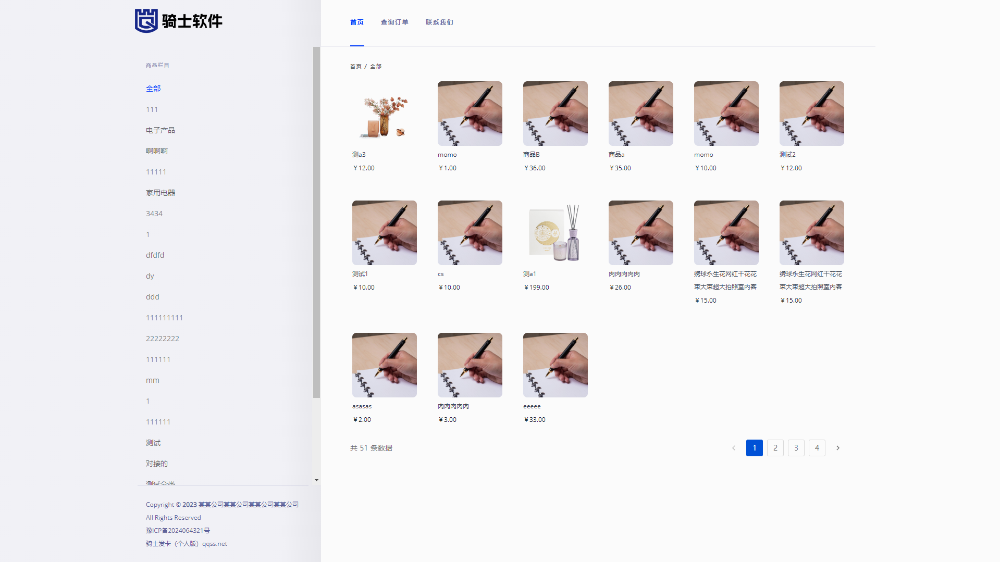
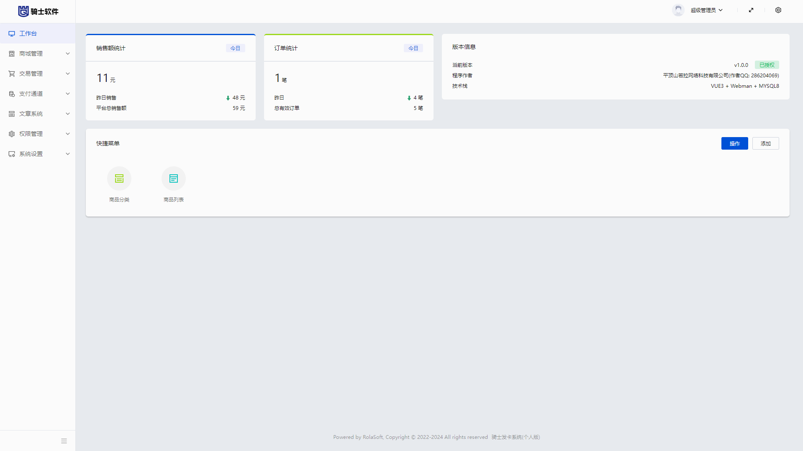
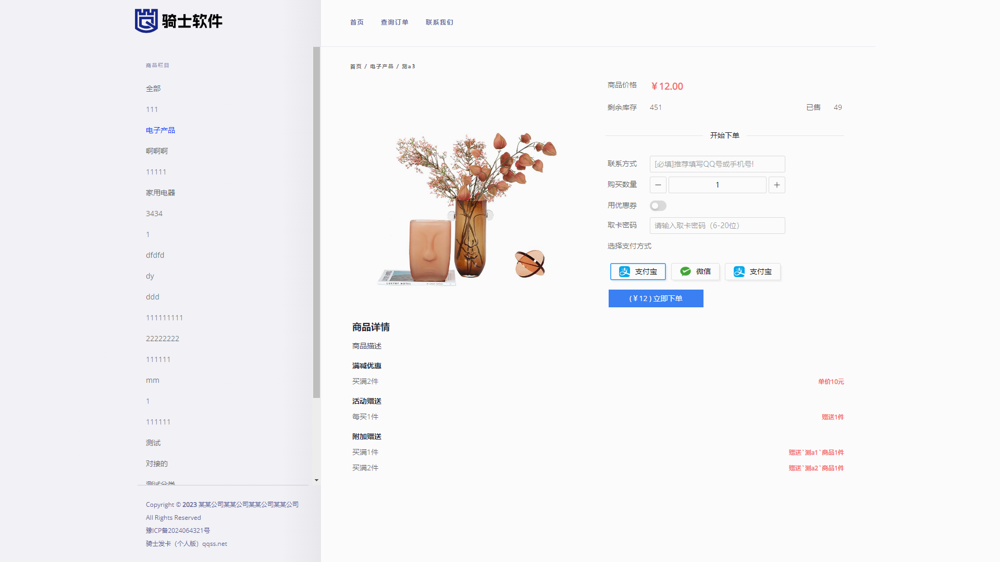
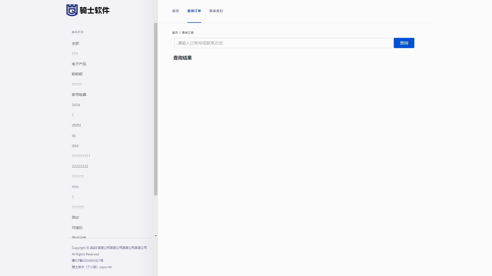
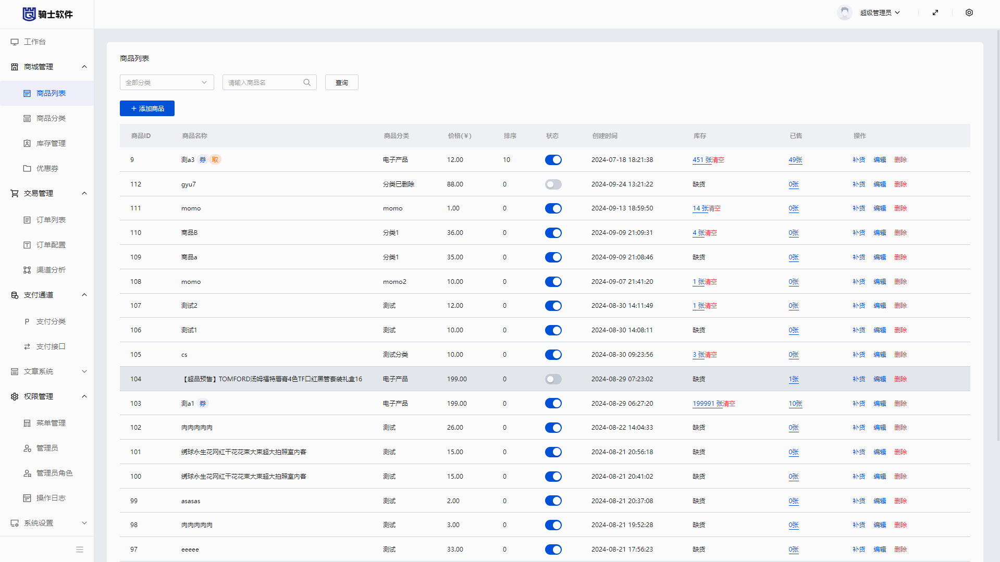
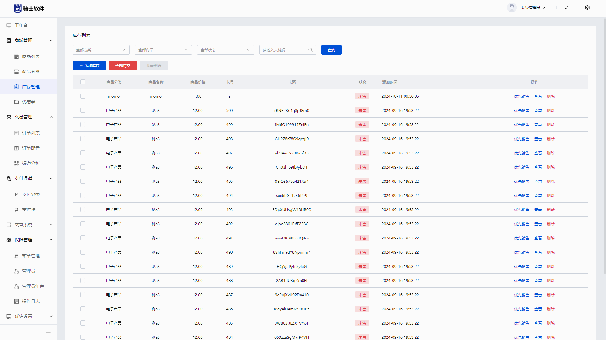
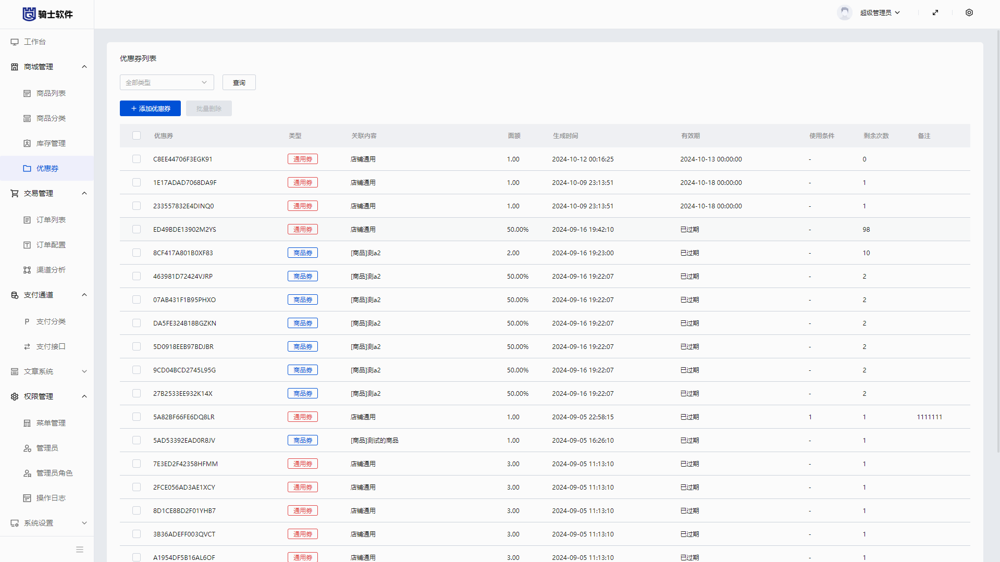
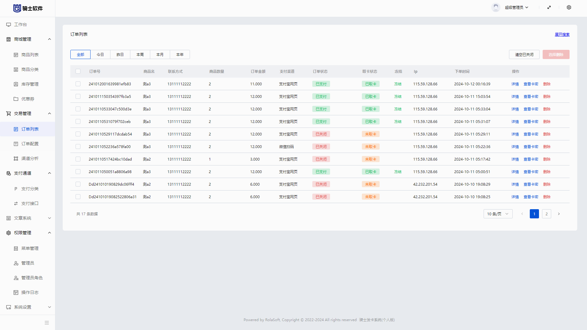
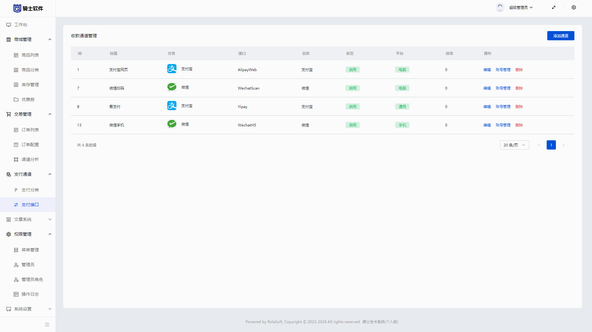
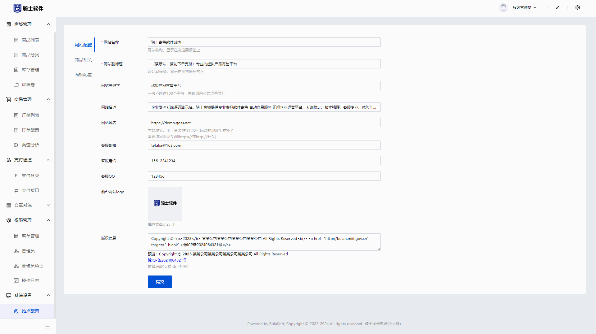

# 🚀🚀🚀骑士个人发卡系统


得益于骑士企业自动发卡系统的灵活性，去繁就简快速构建出一套个人发卡系统。基于webman和vue3构建的个人发卡，采用极简设计还原出使用者初衷

### 主要特性

+ 中后台系统
+ 商品管理
+ 订单管理
+ 优惠券管理
+ 卡号卡密管理
+ 多支付账号轮训

### 🖥️界面预览











# 安装方法

> 运行环境要求
* `Linux`或者`window`服务器，需安装 `PHP`  `MYSQL`  `REDIS`。推荐使用linux服务器 

* `PHP`  >= php8.1，安装扩展`fileinfo`、`redis`

* `Mysql` >= 5.7 ，推荐 `MariaDB`

### 详细安装步骤

+ 1 将源码( /service )到自己网站目录
+ 2 创建数据库
+ 3 删除禁用函数 运行命令
```
curl -Ss https://www.workerman.net/webman/fix-disable-functions | php
```
+ 4
    `.env.example` 改名为 `.env` ，打开`.env`文件配置数据库信息
+ 5 还原数据库
   将./mysql.sql导入到数据库
+ 6 启动服务 运行命令 
```bash
php start.php start -d
```
> 至此 网站服务启动成功 ， 如果需要 80 端口访问( 亦指 域名访问) 请看下一步
 
+ 7  配置反向代理

建议使用 nginx 代理本服务，实现静态加速，反向代理里填  http://127.0.0.1:28080

参考：https://www.workerman.net/doc/webman/others/nginx-proxy.html


 👀 后台访问地址

http://域名/admin/login  账号 密码 admin  qqss.net

### 在线演示

http://39.101.68.140:28080   账号 密码 admin  qqss.net


### 🧐 二次开发联系
+ 采用极简设计，如果有二次开发需求可自行开发，前端项目为 ./vue 目录；后端项目为 ./service 目录 
+ 或者联系作者  QQ 990504246 付费开发
### ⚠️ 注意
+ 本系统可作为学习交流之目的，代码全部开源无任何加密，但如正式使用请务必保留本系统底部预留的版权联系方式，如需移除请联系 QQ 990504246
### 🐹 系统作者
+ 平顶山若拉网络科技有限公司